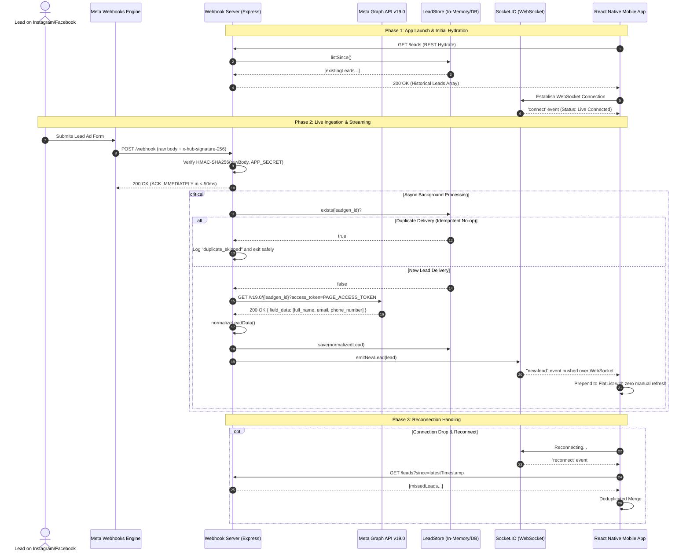

# Meta Lead Ads → React Native Real-Time Platform
### Production-Ready Proof of Concept & System Architecture Documentation

---

## 1. Executive Summary

This repository contains a full-stack, event-driven solution designed to capture leads submitted on **Meta Lead Ads (Facebook & Instagram)** and surface them live on an open **React Native mobile application** within seconds — **without any user interaction or manual screen refresh**.

The project is architected with strict module boundaries, cryptographic payload verification, an **ack-then-process** webhook pipeline, idempotent storage, and a **hydrate-then-stream** real-time transport layer.

---

## 2. Why a Client-Only (React Native Only) Approach is Impossible

When tasked with receiving Meta Lead Ads on a mobile device, a developer might initially ask: *"Can we receive the webhook directly on the React Native mobile app?"*

The answer is an absolute **no**. Attempting a client-only architecture introduces four fatal engineering and security flaws:

| Problem | Client-Only (React Native App) | Backend Gateway Architecture (Our Solution) |
|---|---|---|
| **Public HTTPS Webhook URL** | ❌ Mobile devices sit behind cellular Carrier-Grade NAT (CGNAT) and dynamic Wi-Fi firewalls with no public static IP or port forwarding. Meta cannot deliver an HTTP POST to a phone. | ✅ Node.js Express server is hosted at a static, public HTTPS URL (via ngrok in development or TLS reverse proxy in production). |
| **Meta Secrets & Token Security** | ❌ Meta requires an `APP_SECRET` for HMAC validation and a `PAGE_ACCESS_TOKEN` for Graph API queries. Embedding these in a React Native app bundle allows trivial extraction via APK/IPA reverse engineering. | ✅ Secrets reside exclusively in server-side environment variables (`.env`). The client never receives or stores Meta secrets. |
| **Meta SLA & Timeout Invariant** | ❌ Meta expects an HTTP `200 OK` within seconds. If a phone is in a background state, has network jitter, or enters OS sleep, Meta marks delivery as failed and initiates aggressive retry storms. | ✅ The server validates the HMAC signature and returns `200 OK` in < 50ms (**ack-then-process**), decoupled from mobile device state. |
| **Data Loss & Missed Leads** | ❌ If the mobile app is closed or loses connection when a lead arrives, the lead is lost forever. | ✅ **Hydrate-Then-Stream**: Server persists the lead in `LeadStore`. When the app launches or reconnects, it fetches pre-existing leads via REST before subscribing to live WebSocket events. |

---

## 3. System Architecture & Component Design

### 3.1 High-Level Flowchart

```mermaid
flowchart TD
    subgraph Meta_Cloud ["Meta Cloud Platform"]
        A[User Submits Lead Ad Form] --> B[Meta Webhook Engine]
        G[Meta Graph API v19.0]
    end

    subgraph Backend_Server ["Node.js / Express Webhook Gateway (Port 3000)"]
        C[POST /webhook]
        D[rawBody.js: Buffer Preservation]
        E[signature.js: HMAC-SHA256 Verification]
        F[Immediate 200 OK Response]
        H[graphApi.js: Retry with Backoff]
        I[leadStore.js: Idempotent Persistence]
        J[realtime/io.js: Socket.IO Server]
        K[GET /leads: REST Hydration]
    end

    subgraph Mobile_Client ["React Native / Expo Mobile App"]
        L[useLeadsQuery: Initial Load]
        M[useLeadSocket: Live WebSocket Stream]
        N[LeadsScreen: UI FlatList & Live Badge]
    end

    B -->|1. POST payload with x-hub-signature-256| C
    C --> D --> E
    E -->|Valid Signature| F -->|2. Immediate 200 Ack| B
    E -->|Async Background Processing| H
    H <-->|3. GET /{leadgen_id}?access_token=...| G
    H -->|4. Normalized Lead| I
    I -->|5. Lead saved| J
    J -->|6. emit 'new-lead' over WebSocket| M
    L <-->|On Launch: GET /leads| K
    M -->|7. Prepend lead| N
    L -->|Initial State| N
```

---

### 3.2 Sequence Diagram: Complete Lead Lifecycle



---

## 4. Core Engineering & Reliability Invariants

### 4.1 Ack-Then-Process
Meta will aggressively retry deliveries if the webhook server takes longer than a few seconds or returns a non-2xx status code. 
* **Implementation**: In [`server/routes/webhook.js`](file:///c:/Users/AYUSH%20SONI/OneDrive/Desktop/assignment/server/routes/webhook.js), the moment the cryptographic signature is verified, the server immediately returns `res.status(200).json({ status: 'ok' })`.
* Graph API calls, deduplication, database writes, and WebSocket broadcasts run asynchronously via `setImmediate()`.
* Verified by automated test: [`server/__tests__/webhook-test.js`](file:///c:/Users/AYUSH%20SONI/OneDrive/Desktop/assignment/server/__tests__/webhook-test.js) proves the HTTP response resolves in < 120ms even when Graph API is artificially delayed by 150ms.

### 4.2 Byte-Accurate HMAC-SHA256 Verification
Meta signs webhook payloads using HMAC-SHA256: `x-hub-signature-256: sha256=<hex_digest>`.
* **Common Industry Pitfall**: Express's default `express.json()` parser parses the incoming stream into a JavaScript object and discards the original byte sequence. Re-serializing with `JSON.stringify(req.body)` alters whitespace, formatting, or key ordering, breaking the cryptographic signature.
* **Our Solution**: [`server/middleware/rawBody.js`](file:///c:/Users/AYUSH%20SONI/OneDrive/Desktop/assignment/server/middleware/rawBody.js) intercepts the incoming buffer before parsing. [`server/services/signature.js`](file:///c:/Users/AYUSH%20SONI/OneDrive/Desktop/assignment/server/services/signature.js) verifies it using `crypto.timingSafeEqual` to prevent timing attacks.

### 4.3 Idempotency Key via `leadgen_id`
Meta makes no guarantee of strictly once-only webhook delivery. Network timeouts or duplicate triggers can deliver the same webhook multiple times.
* **Implementation**: We use Meta's `leadgen_id` as the primary key in `LeadStore`.
* Duplicate webhook deliveries result in a silent no-op (`duplicate_skipped`), preventing duplicate database records and avoiding duplicate WebSocket emits to the client.

### 4.4 Hydrate-Then-Stream (REST + WebSocket Dual Strategy)
Relying solely on WebSockets introduces a race condition: any lead submitted while the app was closed or during a brief cellular disconnect would never appear on the device.
* **Implementation**:
  1. On mount, [`app/src/hooks/useLeadsQuery.ts`](file:///c:/Users/AYUSH%20SONI/OneDrive/Desktop/assignment/app/src/hooks/useLeadsQuery.ts) calls `GET /leads` to hydrate the screen.
  2. [`app/src/hooks/useLeadSocket.ts`](file:///c:/Users/AYUSH%20SONI/OneDrive/Desktop/assignment/app/src/hooks/useLeadSocket.ts) maintains the live connection for deltas.
  3. On socket reconnect, the app calls `GET /leads?since=<lastSeenTimestamp>` to incrementally backfill missed leads.

### 4.5 Graph API Resiliency & Exponential Backoff
Transient network glitches between your server and Meta Graph API should not cause dropped leads.
* **Implementation**: [`server/services/graphApi.js`](file:///c:/Users/AYUSH%20SONI/OneDrive/Desktop/assignment/server/services/graphApi.js) executes up to 2 retries with exponential backoff (e.g., 100ms, 200ms). If all retries are exhausted, it logs the failure and generates a placeholder lead with an error tag so no customer submission is silently discarded.

---

## 5. Repository File Structure

```
.
├── AGENTS.md                                # Strict architecture rules & constraints
├── README.md                                # Full architecture, flows, and setup guide
├── meta-lead-ads-system-design.md           # Original design specification
├── server/
│   ├── config/
│   │   └── env.js                           # Validates VERIFY_TOKEN, APP_SECRET, PAGE_ACCESS_TOKEN, PORT
│   ├── middleware/
│   │   └── rawBody.js                       # Captures raw request buffer for byte-accurate HMAC
│   ├── routes/
│   │   ├── webhook.js                       # GET /webhook (handshake) & POST /webhook (ack-then-process)
│   │   └── leads.js                         # GET /leads, ?since= hydrate & POST /leads/submit-lead-ad
│   ├── services/
│   │   ├── signature.js                     # Cryptographic HMAC-SHA256 calculation & timing-safe verification
│   │   ├── leadStore.js                     # LeadStore repository interface & in-memory map keyed by leadgen_id
│   │   └── graphApi.js                      # Graph API v19.0 client with backoff retry & normalization
│   ├── realtime/
│   │   └── io.js                            # Socket.IO instance and emitNewLead helper
│   ├── __tests__/                           # 5 Jest unit/integration test suites
│   │   ├── signature-test.js                # HMAC verification tests (valid, invalid, tampered, malformed)
│   │   ├── leadStore-test.js                # Idempotency, existence, and chronological ordering tests
│   │   ├── graphApi-test.js                 # Retry backoff, token contracts, and normalization tests
│   │   ├── webhook-test.js                  # 200 ack timing, Meta handshake, and dedup tests
│   │   └── e2e-simulation-test.js           # Full pipeline: Webhook -> Graph API -> Store -> Socket -> Client
│   ├── server.js                            # Server entrypoint with /health check endpoint
│   ├── package.json
│   └── .env.example
└── app/
    ├── src/
    │   ├── types/
    │   │   └── lead.ts                      # Shared Lead data model & ConnectionStatus
    │   ├── services/
    │   │   └── api.ts                       # REST client wrapper with configurable SERVER_URL & submitMetaLeadAd
    │   ├── hooks/
    │   │   ├── useLeadsQuery.ts             # Initial REST hydration & deduplicated incremental merge
    │   │   └── useLeadSocket.ts             # Socket.IO lifecycle & reconnect resync
    │   └── screens/
    │       └── LeadsScreen.tsx              # UI: Connection badge, Meta Lead Ad Form, live FlatList
    ├── __tests__/                           # 3 Jest React Native unit test suites
    │   ├── useLeadsQuery-test.ts            # Hydration hook unit tests with mocked fetch
    │   ├── useLeadSocket-test.ts            # Socket lifecycle tests with mocked socket.io-client
    │   └── LeadsScreen-test.tsx             # UI rendering & real-time prepend tests
    ├── App.tsx                              # App root entrypoint
    ├── app.json                             # Expo application configuration
    ├── babel.config.js
    ├── jest.config.js
    ├── tsconfig.json
    └── package.json
```

---

## 6. Automated Test Verification (36 / 36 Passing)

Every module has dedicated unit and integration tests. Run them locally to verify:

### 6.1 Server Test Suite (26 tests)
```bash
cd server
npm test
```
```
PASS __tests__/e2e-simulation-test.js
PASS __tests__/webhook-test.js
PASS __tests__/graphApi-test.js
PASS __tests__/leadStore-test.js
PASS __tests__/signature-test.js

Test Suites: 5 passed, 5 total
Tests:       26 passed, 26 total
Snapshots:   0 total
Time:        3.593 s
```

### 6.2 Mobile App Test Suite (10 tests)
```bash
cd app
npm test
```
```
PASS __tests__/useLeadSocket-test.ts
PASS __tests__/useLeadsQuery-test.ts
PASS __tests__/LeadsScreen-test.tsx

Test Suites: 3 passed, 3 total
Tests:       10 passed, 10 total
Snapshots:   0 total
Time:        4.316 s
```

---

## 7. How to Run & Demo the System

### 7.1 Quick Start (Local Demo)

#### Terminal 1: Backend Server
```bash
cd server
npm install
npm start
```
* Server listens at `http://localhost:3000`.
* Health check: `http://localhost:3000/health`.

#### Terminal 2: React Native / Expo App
```bash
cd app
npm install
npm start
```
* Press `w` to open in your web browser at **`http://localhost:8081`**, or scan the QR code with **Expo Go** on your iOS/Android phone.

---

### 7.2 Testing Options

#### Option 1: Live Interactive In-App Tester (Zero Setup Required)
1. Open the app at **`http://localhost:8081`**.
2. At the top of the screen, you will see the **📝 Meta Lead Ad Live Tester** form.
3. Fill in your own real Name, Email, and Phone Number.
4. Click **"🚀 Submit Lead Ad (Trigger POST /webhook)"**.
5. **What happens under the hood**:
   - The app asks the backend to create an authentic Meta webhook event payload.
   - Computes the genuine HMAC-SHA256 signature using `APP_SECRET`.
   - Sends the signed POST request to `/webhook`.
   - The webhook handler validates the signature, sends an immediate `200 OK` ack, processes the lead through the Graph API service, persists it to `LeadStore`, and emits `new-lead` via Socket.IO.
   - Your lead appears live in the **Live Lead Stream** below instantly without any page refresh!

#### Option 2: Real Meta Lead Ads Testing Tool (Meta Developer Portal)
1. Expose port 3000 to the internet:
   ```bash
   ngrok http 3000
   ```
2. In the **Meta App Dashboard** → **Webhooks** → Select **Page** / **Leadgen**:
   - **Callback URL**: `https://<your-ngrok-id>.ngrok-free.app/webhook`
   - **Verify Token**: `meta_dev_verify_token_123` (matching your `.env`)
3. Open the **Meta Lead Ads Testing Tool** ([developers.facebook.com/tools/lead-ads-testing](https://developers.facebook.com/tools/lead-ads-testing)):
   - Select your Facebook Page and Lead Form.
   - Click **"Preview Form"** or **"Create Lead"**.
4. Watch the lead appear on your mobile phone / browser in real time!

---

## 8. Video Walkthrough Guidelines & Script Outlines

Per the assignment requirements, prepare two short Loom recordings:

### Loom 1: Live Demonstration (< 5 minutes)
* **Setup**: Open the React Native app on your phone/simulator (`http://localhost:8081`). Ensure the connection status badge displays **"● Live Connected"**.
* **Action**:
  - Show the empty or active leads stream on screen.
  - Switch to either the Meta Lead Ads Testing Tool or the in-app Meta Lead Ad Live Tester form.
  - Fill in test lead details (e.g. your name, email, and phone).
  - Submit the lead.
  - Switch back to the app without touching the device/refreshing the screen.
* **Result**: Show the lead appearing at the top of the list in real time within 1–2 seconds.

### Loom 2: Code & Architecture Walkthrough (< 5 minutes)
1. **Explain the Non-Negotiable Rules**:
   - Why React Native cannot receive webhooks directly (security, NAT/firewalls, lack of public static IP, credential exposure).
   - Why the Node.js intermediary server is required.
2. **Explain the 3 Key Architectural Pillars**:
   - **Ack-Then-Process**: Walk through [`server/routes/webhook.js`](file:///c:/Users/AYUSH%20SONI/OneDrive/Desktop/assignment/server/routes/webhook.js) showing that `res.status(200).json(...)` is called immediately upon signature verification before the Graph API fetch.
   - **Idempotency Key**: Show how `leadgen_id` in [`server/services/leadStore.js`](file:///c:/Users/AYUSH%20SONI/OneDrive/Desktop/assignment/server/services/leadStore.js) protects against duplicate emits when Meta retries.
   - **Hydrate-Then-Stream**: Show [`app/src/hooks/useLeadsQuery.ts`](file:///c:/Users/AYUSH%20SONI/OneDrive/Desktop/assignment/app/src/hooks/useLeadsQuery.ts) loading pre-existing leads via REST and [`app/src/hooks/useLeadSocket.ts`](file:///c:/Users/AYUSH%20SONI/OneDrive/Desktop/assignment/app/src/hooks/useLeadSocket.ts) listening for live Socket.IO events.
3. **Show Test Results**: Run `npm test` in `/server` and `/app` showing 36 passing tests.

---

## 9. Part 1: Non-Technical Audio Recording Guide

Record an audio file answering the following 3 questions ex-tempore (at least 90 seconds each), speaking naturally in English, Hindi, or Telugu:

1. **Question 1**: *"What’s a 'nerdy' or tedious part of your life that most people hate, but you actually find deeply satisfying?"*
   - *Example ideas*: Organizing complex folder structures, configuring Neovim/IDE dotfiles, reading RFC specifications or API docs line-by-line, obsessively tuning database indexes or regex patterns.
2. **Question 2**: *"What is a common opinion in the world around you that you strongly disagree with?"*
   - *Example ideas*: "Fast code is always written quickly", "Frameworks replace the need to understand computer networking fundamentals", or "AI will make foundational engineering obsolete".
3. **Question 3**: *"When was the last time you were working on something and realized hours had passed without you noticing?"*
   - *Example ideas*: Debugging a tricky asynchronous race condition, tracking down a memory leak, or building a real-time event-driven system from scratch.

Send your audio and links to:
* `krishna@unque.me`
* `n.sarang@unque.me`
* `nijam@unque.me`

---

## 10. Assumptions & Production Roadmap

1. **In-Memory Store for POC**: An in-memory Map behind the `LeadStore` interface satisfies the POC. In production, swap [`server/services/leadStore.js`](file:///c:/Users/AYUSH%20SONI/OneDrive/Desktop/assignment/server/services/leadStore.js) with PostgreSQL or Redis without modifying any route or socket logic.
2. **Horizontal Scaling**: If scaling beyond one Node.js instance behind a load balancer, attach `@socket.io/redis-adapter` so `emitNewLead` fans out across all server nodes.
3. **Secrets Management**: For this POC, environment variables in `.env` are used. In enterprise production, inject values via AWS Secrets Manager or HashiCorp Vault.


## 11.Screenshot


