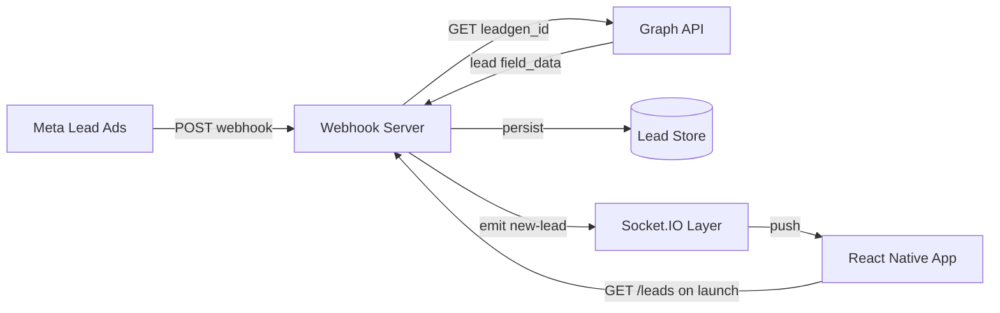
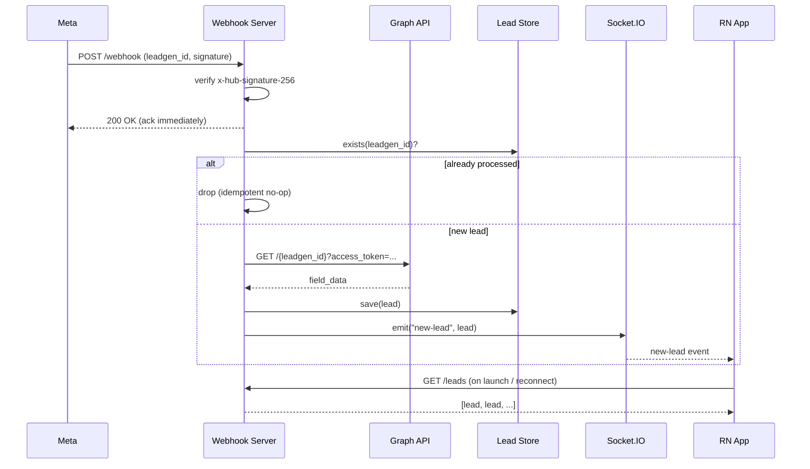

# Meta Lead Ads → React Native Real-Time System — Full System Design & Antigravity Build Plan

---

## 1. Problem Statement

Build a system where a lead submitted on a Meta (Facebook/Instagram) Lead Ad is captured server-side within seconds and surfaced live inside a React Native app, with no manual refresh — implemented as a POC but designed the way a production version would be.

### 1.1 Functional Requirements
- Receive and validate Meta Lead Ads webhook events.
- Fetch complete lead field data via the Graph API using the `leadgen_id`.
- Persist each lead exactly once (dedup on retries).
- Push new leads to all connected mobile clients in real time.
- Mobile app displays a live, ordered list of leads with connection status.
- Historical leads load on app start (not just live ones after connect).

### 1.2 Non-Functional Requirements
| Concern | Target for this design |
|---|---|
| Latency (lead submit → app display) | < 3s under normal conditions |
| Availability of webhook endpoint | Must always return fast (<1s) to avoid Meta retry storms |
| Idempotency | Same `leadgen_id` processed twice must not duplicate in UI or storage |
| Security | Webhook payload authenticity verified; secrets never in client code |
| Scalability | Design should tolerate horizontal scaling of the server without losing sockets |
| Observability | Every lead's journey traceable via logs/correlation ID |
| Testability | Every layer (webhook, transport, UI) independently unit-testable |

### 1.3 Explicit Non-Goals (for the POC)
- Multi-tenant support (multiple Pages/Forms per deployment) — noted as a future extension, not built now.
- Authentication/login on the mobile app — out of scope, single shared view.
- Production-grade secrets management (Vault/KMS) — `.env` is acceptable for POC, but the design notes where it plugs in later.

---

## 2. High-Level Architecture



**Components:**

1. **Webhook Server (Node/Express)** — the only internet-facing surface. Verifies Meta, fetches lead detail, persists it, and hands it to the real-time layer.
2. **Lead Store** — for the POC this is an in-process store behind a repository interface (see §4.4) so it can be swapped for Postgres/SQLite/Redis later without touching business logic.
3. **Real-Time Layer (Socket.IO)** — decoupled from the webhook handler via an internal event emitter, so the transport can be swapped (SSE, MQTT, Pusher) without touching webhook logic.
4. **React Native App** — pulls initial state via REST (`GET /leads`), then subscribes to the live socket for deltas. This "REST-hydrate + socket-stream" pattern avoids the classic bug of leads submitted before app launch never appearing.

---

## 3. Request/Response & Data Flow (Sequence)



Key design decision: **ack-then-process**. Meta's webhook delivery retries aggressively on non-2xx or slow responses. The handler returns `200` the instant the signature check passes, and does the Graph API fetch + emit asynchronously. This is the single most important reliability decision in the system — skipping it is the most common cause of duplicate/lost leads in real implementations.

---

## 4. Component Design

### 4.1 Webhook Server — Module Breakdown

```
server/
├── server.js              # bootstraps Express + HTTP server + Socket.IO
├── config/env.js           # loads & validates required env vars at boot
├── routes/webhook.js       # GET/POST /webhook
├── routes/leads.js         # GET /leads (REST hydrate endpoint)
├── services/graphApi.js    # wraps Graph API calls (mockable)
├── services/leadStore.js   # repository interface + in-memory impl
├── services/signature.js   # HMAC verification
├── realtime/io.js          # Socket.IO instance + emit helpers
├── middleware/rawBody.js   # captures raw body for signature verification
└── __tests__/
```

Splitting signature verification, Graph API access, and storage into separate, narrowly-scoped modules is what makes each one unit-testable in isolation with mocks, rather than needing a live server for every test.

### 4.2 Webhook Endpoint Contracts

**`GET /webhook`** (Meta's subscription verification)
| Param | Source | Behavior |
|---|---|---|
| `hub.mode` | query | must equal `subscribe` |
| `hub.verify_token` | query | must equal `process.env.VERIFY_TOKEN` |
| `hub.challenge` | query | echoed back as plain text on success |

Response: `200` + raw `hub.challenge` string, or `403` on mismatch.

**`POST /webhook`** (lead notification)
- Header `x-hub-signature-256: sha256=<hmac>` required.
- HMAC computed over the **raw** request body (not the parsed JSON — this is a common bug: Express's default body parser reserializes JSON, changing byte-for-byte content and breaking the hash) using `APP_SECRET`.
- Body shape (Meta's actual format):
```json
{
  "entry": [{
    "id": "PAGE_ID",
    "changes": [{
      "field": "leadgen",
      "value": { "leadgen_id": "123", "form_id": "456", "page_id": "789", "created_time": 1234567890 }
    }]
  }]
}
```
- Response: `200` immediately after signature check (see ack-then-process above). `401` on bad signature.

**`GET /leads`** (REST hydrate for app launch/reconnect)
- Returns `[{ id, name, email, phone, formId, receivedAt }]`, newest first.
- Supports `?since=<ISO timestamp>` for incremental resync after a dropped socket.

### 4.3 Lead Data Model

```ts
interface Lead {
  id: string;          // leadgen_id from Meta — used as the dedup key
  formId: string;
  pageId: string;
  name?: string;
  email?: string;
  phone?: string;
  rawFieldData: Record<string, string>; // full field_data, in case UI needs more later
  receivedAt: string;  // ISO timestamp, server-side receipt time
}
```

Using Meta's `leadgen_id` directly as the primary key is what makes idempotency trivial: a duplicate webhook delivery (Meta retries on slow acks) becomes a no-op `INSERT ... ON CONFLICT DO NOTHING` — or, for the in-memory POC, a `Map.has()` check — instead of needing separate dedup infrastructure.

### 4.4 Lead Store — Repository Interface

```ts
interface LeadStore {
  exists(id: string): Promise<boolean>;
  save(lead: Lead): Promise<void>;
  listSince(timestamp?: string): Promise<Lead[]>;
}
```

POC implementation: in-memory `Map` keyed by `id`. Because it's behind this interface, swapping in SQLite (via `better-sqlite3`) or Postgres later is a single-file change — nothing in `routes/` or `realtime/` needs to know.

### 4.5 Real-Time Layer

- Socket.IO server attached to the same HTTP server instance as Express (not a separate port) — simpler ngrok tunneling, one origin to secure.
- On connection, server does **not** immediately push history — the client explicitly calls `GET /leads` first (REST hydrate), then opens the socket for live deltas. This avoids a race where a lead arrives between "socket connects" and "history sent" and either gets shown twice or missed.
- Event contract:
  - `connect` / `disconnect` — built-in.
  - `new-lead` — server → client, payload = single `Lead` object.
- **Scaling note (documented, not built for POC):** a single Node process holds all sockets in memory. To run more than one server instance behind a load balancer, you'd add the `@socket.io/redis-adapter` so `emit()` fans out across instances, and enable sticky sessions at the LB so a client's reconnect lands on a server that still recognizes its session. Flagging this now avoids a rewrite later if the POC needs to scale.

### 4.6 React Native App — Module Breakdown

```
app/
├── src/
│   ├── screens/LeadsScreen.tsx      # presentation only
│   ├── hooks/useLeadSocket.ts       # connection lifecycle + event wiring
│   ├── hooks/useLeadsQuery.ts       # initial REST fetch (GET /leads)
│   ├── services/api.ts              # fetch wrapper, SERVER_URL config
│   └── types/lead.ts
└── __tests__/
```

Separating `useLeadSocket` (live deltas) from `useLeadsQuery` (initial load) mirrors the server's hydrate-then-stream pattern and lets each be tested with a mocked socket/fetch independently of the screen's render logic.

**Reconnection handling:** Socket.IO client reconnects automatically by default, but on `reconnect`, the app should re-call `GET /leads?since=<lastSeenTimestamp>` to catch anything missed while offline — sockets alone don't guarantee delivery during a dropped connection.

---

## 5. Security Design

| Threat | Mitigation |
|---|---|
| Forged webhook calls | Mandatory HMAC-SHA256 verification (`x-hub-signature-256`) over the raw body before any processing |
| Replay of an old valid signature | `created_time` in the payload is checked against a reasonable window (e.g. reject if >5 min old) — noted as a hardening step beyond the POC baseline |
| Secrets in source control | `APP_SECRET`, `VERIFY_TOKEN`, `PAGE_ACCESS_TOKEN` only via `.env`, with `.env.example` committed and `.env` gitignored |
| Secrets in the mobile client | The app never holds Meta credentials — it only talks to your own server, which is the only Graph API caller |
| Unencrypted transport | ngrok provides HTTPS in dev; production deployment must terminate TLS at the load balancer/reverse proxy |
| Open Socket.IO endpoint | For POC, unauthenticated is acceptable (single internal demo); documented next step is a short-lived token issued by `GET /leads` and validated on socket `connect` |

---

## 6. Reliability & Failure Handling

- **Meta retry behavior:** Meta retries webhook delivery on non-2xx/timeout, so the idempotency key (§4.3/4.4) is not optional — it's the mechanism that makes retries safe rather than harmful.
- **Graph API failure:** if the Graph API call fails after the webhook has already been ack'd (200 sent), the lead must not be silently dropped. Design: on failure, log the error with the `leadgen_id` and retry with exponential backoff (2–3 attempts) before giving up and recording a "fetch failed" placeholder lead so it's at least visible for manual follow-up, rather than vanishing.
- **Socket disconnects:** handled by the REST-resync-on-reconnect pattern in §4.6, not by trying to make Socket.IO itself lossless.
- **Server restart:** in-memory store means a POC restart loses history — acceptable for the assignment, explicitly called out as the first thing to fix (swap to SQLite) before any real usage.

---

## 7. Observability

- Structured logs (JSON) for every webhook hit: `{ leadgenId, event: 'received' | 'verified' | 'fetched' | 'emitted' | 'error', durationMs }`.
- A correlation ID (the `leadgen_id` itself) threads through every log line for a given lead, so its full journey from Meta to the app can be traced in one grep.
- Minimal `/health` endpoint for uptime checks (returns `200` + socket-connected-client count).

---

## 8. Testing Strategy

| Layer | Tool | What's covered |
|---|---|---|
| Signature verification | Jest (unit) | Valid signature accepted, invalid/missing rejected, tampered body rejected |
| Webhook route | Jest + supertest | `GET /webhook` challenge/reject logic; `POST /webhook` ack timing, idempotent double-delivery |
| Graph API service | Jest (unit, axios mocked) | Correct URL/params built, error handling on non-200 |
| Lead store | Jest (unit) | `exists`/`save`/`listSince` correctness, dedup on repeated `save` |
| Real-time emit | Jest (unit, mocked io) | `new-lead` emitted with correct payload shape exactly once per unique lead |
| `useLeadSocket` hook | Jest + React Native Testing Library, mocked `socket.io-client` | Connects on mount, updates state on `new-lead`, cleans up on unmount |
| `useLeadsQuery` hook | Jest, mocked fetch | Loads initial leads, handles fetch error state |
| `LeadsScreen` | React Native Testing Library | Empty state, populated list, connection-status badge reflects hook state |
| End-to-end (manual, not automated in POC) | ngrok + Meta Lead Ads Testing Tool | Full real flow: submit → webhook → Graph API → socket → app render |

This is also exactly the test matrix the Antigravity loop should walk through — each row becomes a "write test → write code → run → fix" cycle rather than one big untested implementation at the end.

---

## 9. Deployment View (for the demo)

```
Local machine
 ├─ node server.js         (port 3000)
 ├─ ngrok http 3000         → public HTTPS URL registered with Meta
 └─ expo start              → simulator/device connects to server via LAN IP or ngrok URL
```

Production evolution (documented, not built): containerize server (Dockerfile), deploy behind a TLS-terminating load balancer, swap in-memory store for Postgres, add the Redis Socket.IO adapter if running >1 instance, and move `.env` values into a secrets manager.

---

## 10. Dependencies

**server/package.json**
```json
{
  "dependencies": {
    "express": "^4.18.2",
    "socket.io": "^4.7.2",
    "axios": "^1.6.0",
    "dotenv": "^16.4.5"
  },
  "devDependencies": {
    "jest": "^29.7.0",
    "supertest": "^6.3.4",
    "nodemon": "^3.1.0"
  }
}
```

**app/package.json (relevant additions)**
```json
{
  "dependencies": {
    "expo": "~50.0.0",
    "react-native": "0.73.x",
    "socket.io-client": "^4.7.2"
  },
  "devDependencies": {
    "jest": "^29.7.0",
    "jest-expo": "~50.0.0",
    "@testing-library/react-native": "^12.4.0",
    "react-test-renderer": "18.2.0"
  }
}
```

---

## 11. AGENTS.md (rules file for the Antigravity agent)

```markdown
# Project Rules

- Server code in /server, app code in /app. Never mix them.
- Follow the module boundaries in the system design doc exactly:
  routes/, services/, realtime/, middleware/ on the server;
  screens/, hooks/, services/, types/ on the app.
- Lead store must sit behind the LeadStore interface — no direct Map/array
  access from routes.
- HMAC signature must be computed over the RAW request body, not re-parsed JSON.
  Capture raw body via middleware before Express's json() parser transforms it.
- Webhook POST handler must respond 200 BEFORE the Graph API call resolves
  (ack-then-process). Never await the Graph API fetch before responding.
- Idempotency: use leadgen_id as the store's primary key; a duplicate delivery
  must be a silent no-op, not an error and not a duplicate emit.
- After writing or editing ANY file, run the relevant test suite before moving on:
  - Server change → `cd server && npm test`
  - App change → `cd app && npm test`
- Do not proceed to the next step until the current step's tests pass.
- If a test fails, fix the code (not the test, unless the test itself is wrong)
  and re-run. Repeat until green.
- Use TypeScript in /app. Plain JS with JSDoc types is fine in /server.
- Never commit secrets — .env is gitignored, .env.example lists required keys
  with placeholder values.
```

---

## 12. One-Shot Antigravity Build Prompt

```
You are building the Meta Lead Ads → React Native real-time system described in
the system design document and AGENTS.md in this workspace. Follow both strictly.

Execute the following IN ORDER, without stopping for confirmation, running the
relevant test suite after every code change and fixing failures before moving on:

1. PLAN: Read AGENTS.md and the system design doc. List every file you will
   create in /server and /app, matching the module breakdown exactly.

2. SERVER FOUNDATION:
   - config/env.js: load and validate VERIFY_TOKEN, APP_SECRET,
     PAGE_ACCESS_TOKEN, PORT at startup; throw a clear error if any are missing.
   - middleware/rawBody.js: capture the raw request body buffer before JSON
     parsing, for signature verification.
   - services/signature.js: HMAC-SHA256 verification function, unit-testable
     with a raw body + secret + expected signature.
   Write __tests__/signature-test.js covering valid, invalid, and tampered-body
   cases. Run `npm test` in /server. Fix until green.

3. SERVER — LEAD STORE:
   - services/leadStore.js: implement the LeadStore interface (exists, save,
     listSince) with an in-memory Map keyed by leadgen_id.
   Write a unit test proving a duplicate save() does not create a second entry.
   Run tests. Fix until green.

4. SERVER — GRAPH API SERVICE:
   - services/graphApi.js: fetchLead(leadgenId) → calls
     GET https://graph.facebook.com/v19.0/{leadgenId}?access_token=...,
     normalizes field_data into the Lead shape from the design doc, retries
     up to 2 times with backoff on failure.
   Write a unit test with axios mocked — success case and failure/retry case.
   Run tests. Fix until green.

5. SERVER — WEBHOOK ROUTES:
   - routes/webhook.js: GET /webhook verification handler; POST /webhook that
     verifies signature, responds 200 immediately (ack-then-process), then
     checks leadStore.exists before calling graphApi.fetchLead and
     leadStore.save, then emits "new-lead" via the realtime layer.
   - realtime/io.js: Socket.IO instance attached to the shared HTTP server,
     with an emitNewLead(lead) helper.
   - routes/leads.js: GET /leads (optionally ?since=) returning stored leads
     via leadStore.listSince.
   Write __tests__/webhook-test.js with supertest covering: verification
   success/failure, invalid signature rejection, ack-before-fetch timing
   (mock a slow graphApi and assert the response already returned), and
   duplicate leadgen_id producing exactly one emit. Run tests. Fix until green.

6. APP — DATA HOOKS:
   - src/services/api.ts: fetch wrapper with configurable SERVER_URL.
   - src/hooks/useLeadsQuery.ts: fetch GET /leads on mount, expose
     { leads, loading, error, refetch }.
   - src/hooks/useLeadSocket.ts: manage socket.io-client connection lifecycle,
     expose { connectionStatus, onNewLead subscription }; on 'reconnect',
     trigger a resync via the leads query's refetch(since=lastSeenTimestamp).
   Write unit tests for both hooks with fetch and socket.io-client mocked.
   Run `npm test` in /app. Fix until green.

7. APP — SCREEN:
   - src/screens/LeadsScreen.tsx: combine both hooks, render connection-status
     badge, FlatList of leads (name/email/phone/receivedAt), empty state.
   Write __tests__/LeadsScreen-test.tsx: empty state, populated list, status
   badge reflects hook state, new-lead event prepends to the list.
   Run tests. Fix until green.

8. CROSS-CHECK: Confirm the Lead shape emitted by the server exactly matches
   what the app's types/hooks expect (field names, optional fields). Fix any
   mismatch on either side and re-run both full test suites.

9. FINAL VERIFICATION: Run `npm test` in /server and /app from a clean state.
   Report total passing test counts per suite. Report any deviations you made
   from the design doc and why, under "Assumptions Made."

Do not ask me questions mid-way — make reasonable, documented assumptions and
keep looping between code and tests until everything is green.
```

---

## 13. Manual Steps (Meta dashboard — cannot be automated)

1. **Meta for Developers → Your App → Webhooks**
   - Subscribe to the `leadgen` field
   - Callback URL = `https://<ngrok-id>.ngrok.io/webhook`, Verify Token = your `VERIFY_TOKEN`
   - Subscribe the target Page
2. **Lead Ads Testing Tool** (Meta for Developers → Tools)
   - Select Page and Form → "Preview Form" → submit test data

---

## 14. Running the Full System End-to-End

```bash
# Terminal 1
cd server && npm install && node server.js

# Terminal 2
ngrok http 3000
# update the Meta webhook callback URL if this changed

# Terminal 3
cd app && npm install && npx expo start
```

**Verification checklist:**
- [ ] App shows "Connected" and loads any pre-existing leads via `GET /leads` on launch
- [ ] Submit a test lead via the Lead Ads Testing Tool
- [ ] Lead appears in the app within a few seconds without manual refresh
- [ ] Resubmitting the same test lead (if the tool allows) does not create a duplicate
- [ ] `npm test` green in both `/server` and `/app`

---

## 15. Deliverables Checklist

- [ ] Git repository with complete `/server` and `/app`, matching this module design
- [ ] All unit tests passing in both projects (per §8 matrix)
- [ ] `AGENTS.md` and this design doc committed as documentation
- [ ] Documented assumptions (agent's final report + this doc's §1.3 non-goals)
- [ ] Demo video: app open with pre-existing leads loaded → test lead submitted in Meta tool → lead appears live
- [ ] Short walkthrough video explaining architecture and key design decisions (ack-then-process, idempotency key, hydrate-then-stream)
